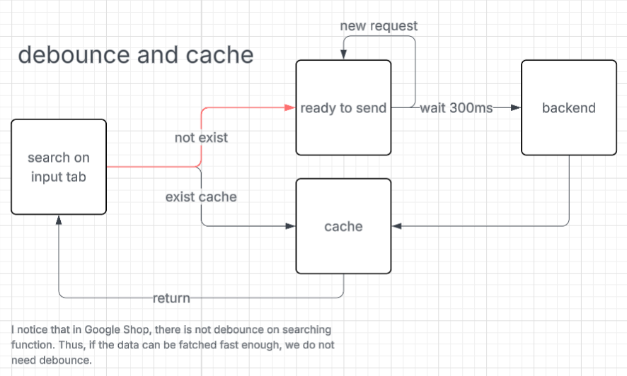

# ShopBest  
A platform which enables you to search and compare goods from different platform

## Installation  
```
npm install
npm start
```

## Update
### 2025-8-9
craete the whole layout UI/UX and react component using
[Figma make](https://www.figma.com/make/b7TPhDSmWBc1zlZmMk8BMe/Untitled?node-id=0-4&t=V1aVwm6pnx9EWs1n-0), the file has some compatible issue with local environment, but it can be easily fixed by [depcheck](https://www.npmjs.com/package/depcheck). Also, the code generate by AI runs in tailwind and TS
### 2025-8-11
build a backend server using Node.js and fetch data from [SerpApi](https://serpapi.com/), the data is stored in Redux
### 2025-8-12
System design for search input to show results for suggestions, use suggestions for detailed product list



